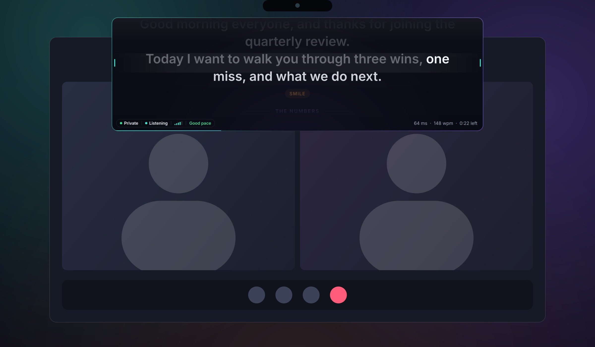

<div align="center">


# Glass Prompter

**A see-through teleprompter that sits right under your webcam.**
It follows your voice word by word, reads your script aloud, and stays off the screen share.
Free and open source (MIT) for Windows and Mac.

### [Download from the website &rarr;](https://tokunboajayi.github.io/glass-prompter/)

[Website](https://tokunboajayi.github.io/glass-prompter/) &nbsp;&middot;&nbsp;
[All downloads](https://github.com/tokunboajayi/glass-prompter/releases/latest) &nbsp;&middot;&nbsp;
[What's new](CHANGELOG.md) &nbsp;&middot;&nbsp;
[Report a problem](https://github.com/tokunboajayi/glass-prompter/issues)



</div>

---

## Contents

1. [Install](#install): [Windows](#windows) · [Mac](#mac) · [Linux](#linux-from-source)
2. [First five minutes](#first-five-minutes)
3. [Keyboard shortcuts](#keyboard-shortcuts)
4. [Phone remote](#phone-remote)
5. [Updates, uninstall and your data](#updates-uninstall-and-your-data)
6. [Troubleshooting](#troubleshooting)
7. [For developers](#for-developers)

---

## Install

The quickest way is the **[website](https://tokunboajayi.github.io/glass-prompter/)**. It detects your computer and gives you the right download button.

| Your computer | Download | Or one command |
|---|---|---|
| **Windows 10 (2004+) / 11**, 64-bit | [`GlassPrompter-Setup-x.y.z.exe`](https://github.com/tokunboajayi/glass-prompter/releases/latest) | `winget install TokunboAjayi.GlassPrompter` (in review at Microsoft) |
| **Mac with Apple silicon** (M1 to M4), macOS 13+ | [`GlassPrompter-x.y.z-macOS-arm64.dmg`](https://github.com/tokunboajayi/glass-prompter/releases/latest) | `brew install --cask tokunboajayi/tap/glass-prompter` |
| **Mac with Intel**, macOS 13+ | [`GlassPrompter-x.y.z-macOS-x86_64.dmg`](https://github.com/tokunboajayi/glass-prompter/releases/latest) | same Homebrew command |
| **Linux** | not packaged yet | [run from source](#linux-from-source) |

> Not sure which Mac you have? Open the Apple menu &rsaquo; **About This Mac**. If it says *Chip: Apple M…*, you have Apple silicon. If it says *Processor: Intel*, you have an Intel Mac.

### Windows

1. Download **`GlassPrompter-Setup-x.y.z.exe`** from the [website](https://tokunboajayi.github.io/glass-prompter/).
2. Double-click it. It installs just for you, so no admin password is needed.
3. If you see **"Windows protected your PC"**, click **More info**, then **Run anyway**. The app isn't code-signed yet, which is why Windows shows this warning for new apps.
4. Glass Prompter opens and appears in your Start menu. Choose **Start at login** in Settings if you want it to open with Windows.

**With winget**, which comes built into Windows 11. Open *Terminal* and run:

```powershell
winget install TokunboAjayi.GlassPrompter
```

> winget will work once Microsoft approves the listing ([pull request](https://github.com/microsoft/winget-pkgs/pull/445458)). Until then, use the installer.

### Mac

1. Download the **.dmg** for your chip from the [website](https://tokunboajayi.github.io/glass-prompter/).
2. Open it and drag **Glass Prompter** into **Applications**.
3. **The first time only:** right-click Glass Prompter in Applications and choose **Open**, then **Open** again.
   On **macOS 15 or later**, open **System Settings &rsaquo; Privacy & Security**, scroll down, and click **Open Anyway**.
   *(This is needed because the app isn't notarized by Apple yet.)*
4. Click **Allow** when it asks for the microphone, so Voice Follow can hear you.

**With Homebrew.** Open *Terminal* and run:

```bash
brew install --cask tokunboajayi/tap/glass-prompter
```

### Linux (from source)

Linux works, but some features aren't available there: there's no screen-share hiding and no global shortcuts. You need Python 3.10 or newer.

```bash
git clone https://github.com/tokunboajayi/glass-prompter.git
cd glass-prompter
python3 -m pip install -r requirements.txt
python3 glass_prompter.pyw
```

For Voice Follow you also need the free offline speech model. [CONTRIBUTING.md](CONTRIBUTING.md#run-from-source) explains where to put it.

---

## First five minutes

1. **Place it.** Drag the prompter right under your webcam, so your eyes stay near the lens while you read. Drag its edges to resize it.
2. **Add a script.** Click the **Scripts** button (or press <kbd>E</kbd>), then paste text or import a `.docx`, `.md` or `.txt` file. You can also drop files into the **Documents/Glass Prompter** folder.
3. **Read.** Press <kbd>Space</kbd> to scroll at your chosen pace. Use <kbd>&uarr;</kbd> and <kbd>&darr;</kbd> to go faster or slower.
4. **Or let it follow your voice.** Press <kbd>V</kbd>, then <kbd>Space</kbd>, and start talking. The text scrolls as you speak, and it runs entirely offline.
5. **Check the privacy badge** in the bottom-left corner before a call.
   - **Green "Private":** viewers can't see the prompter on screen share.
   - **On macOS 15+:** share a single window, not your entire screen.

Script tips:

| Write this on its own line | What it does |
|---|---|
| `# Opening` | A section. Jump between sections with <kbd>PgUp</kbd>/<kbd>PgDn</kbd> or from your phone. |
| `[PAUSE]` | Scrolling stops here until you press play. |
| `[SMILE]`, `[SHOW SLIDE 3]` | A cue for you, shown in amber. It's never read out. |

Everything else is one click away in the **&#8943; menu**: text size, mirror text, ghost mode, phone remote and settings.

---

## Keyboard shortcuts

Press <kbd>F1</kbd> in the app to see these at any time.

**Anywhere, even when another app is focused.** Hold <kbd>Ctrl</kbd>+<kbd>Alt</kbd> on Windows, or <kbd>Control</kbd>+<kbd>Option</kbd> on a Mac, and press:

| Key | Action |
|---|---|
| <kbd>Space</kbd> | Play / pause |
| <kbd>&uarr;</kbd> / <kbd>&darr;</kbd> | Faster / slower |
| <kbd>V</kbd> | Voice Follow on/off |
| <kbd>H</kbd> | Show / hide the prompter |
| <kbd>G</kbd> | Ghost mode: see-through and click-through |
| <kbd>[</kbd> / <kbd>]</kbd> | Ghost more see-through / more solid |

**While the prompter is focused:**

| Key | Action |
|---|---|
| <kbd>Space</kbd> | Play / pause |
| <kbd>L</kbd> | Read aloud in a natural voice |
| <kbd>E</kbd> | Scripts library |
| <kbd>+</kbd> / <kbd>-</kbd> | Bigger / smaller text |
| <kbd>PgUp</kbd> / <kbd>PgDn</kbd> | Previous / next section |
| <kbd>C</kbd> | Screen-share privacy on/off |
| <kbd>M</kbd> | Mirror text (for beam-splitter glass) |
| <kbd>A</kbd> | AI assistant (chat that can see your screen) |
| <kbd>S</kbd> | Screenshot to Pictures › Glass Prompter (also copied) |
| <kbd>Esc</kbd> | Close sheets and dialogs |

---

## Phone remote

Control the prompter from across the room. You don't need to install an app on your phone.

1. On your computer, open **&#8943; &rsaquo; Phone remote**.
2. Scan the QR code with your phone's camera. Your phone and computer must be on the **same Wi-Fi**.
3. Enter the 6-digit PIN shown on your computer.

From the phone you can:

- play, change speed and jump between sections;
- set the ghost level and start Read Aloud;
- type or upload new scripts;
- **see your computer's screen live** (Screen tab);
- **chat with an AI that can see your screen and script** (AI tab).

It works over your Wi-Fi only and never goes through the internet. On Windows, click **Allow** on the firewall prompt the first time.

### Screen view and AI assistant

- **Screen tab:** your computer's screen, refreshed about every 1.5 seconds. Tap it for full size and pinch to zoom. On Windows the prompter never appears in it. On a Mac, allow Glass Prompter under **System Settings &rsaquo; Privacy & Security &rsaquo; Screen Recording**. Turn it off in **Settings &rsaquo; Privacy &rsaquo; Phone can view my screen**.
- **AI assistant on the computer:** press <kbd>A</kbd> on the prompter or choose **&#8943; &rsaquo; AI assistant**. Same chat, on your PC.
- **Screenshots:** press <kbd>S</kbd> on the prompter, or tap **Save screenshot** on the phone's Screen tab.
- **AI tab:** a chat with Claude that answers any question. It can look at your current screen, search the web and read the script on the prompter. Ask *"what should I say about this slide?"* or *"tighten my intro"*, then tap **Send to prompter** to read the answer.
  1. Create an API key at [console.anthropic.com](https://console.anthropic.com/settings/keys). Usage is billed to your Anthropic account (typically a few cents or less per question with a screenshot).
  2. Paste it into **Settings &rsaquo; AI assistant** on your computer.

  The key stays on your computer and is never sent to the phone. Messages go from your computer straight to `api.anthropic.com`, and only when you press Send.

---

## Updates, uninstall and your data

**Updates** arrive inside the app. Once a day it checks GitHub, and when a new version is out you'll see **Update to x.y.z** in the tray (Windows) or menu bar (Mac).

- Every download is checked against its published SHA-256 fingerprint before it installs.
- On Windows the update installs and reopens the app on its own.
- On a Mac the new disk image opens, and you drag the app into Applications again.
- You can turn update checks off in **Settings &rsaquo; System**.
- **Package managers:** `winget upgrade TokunboAjayi.GlassPrompter` or `brew upgrade --cask glass-prompter`.

**Uninstall:**

| | How |
|---|---|
| Windows | **Settings &rsaquo; Apps &rsaquo; Installed apps &rsaquo; Glass Prompter &rsaquo; Uninstall**, or `winget uninstall TokunboAjayi.GlassPrompter` |
| Mac | Drag the app from Applications to the Trash, or `brew uninstall --cask glass-prompter` (add `--zap` to also delete your data) |

**Your data** stays on your computer: scripts, settings, the daily backups (the last 7 are kept) and logs.

| | Folder |
|---|---|
| Windows | `%APPDATA%\GlassPrompter` |
| Mac | `~/Library/Application Support/GlassPrompter` |

Voice recognition and the read-aloud voice both run on your computer. Audio never leaves it. The only internet requests are the optional daily update check to `api.github.com` and, if you set up the AI assistant, the messages you send to `api.anthropic.com`.

---

## Troubleshooting

<details><summary><b>People on the call can see the prompter</b></summary>

Check the badge in the bottom-left corner.

- **Windows 10 (2004+) and 11:** the prompter is hidden from Zoom, Teams, Meet and OBS. If the badge isn't green, press <kbd>C</kbd>.
- **macOS 15 and later:** Apple lets screen recorders capture every window. Share a single window or app, not the entire screen.

</details>

<details><summary><b>Voice Follow doesn't move</b></summary>

1. Open **Settings &rsaquo; Voice Follow** and pick the right microphone.
2. On a Mac, check **System Settings &rsaquo; Privacy & Security &rsaquo; Microphone** and turn Glass Prompter on.
3. The live latency shown next to "Listening" should be under about 100 ms.

</details>

<details><summary><b>A global shortcut doesn't work</b></summary>

Another app is probably using the same keys. For example, PowerToys often uses <kbd>Ctrl</kbd>+<kbd>Alt</kbd>+<kbd>Space</kbd>. Glass Prompter falls back to watching the keyboard itself, so the shortcut still works, but it may respond a little later. Free the keys in the other app to fix it fully.

</details>

<details><summary><b>Windows says "Windows protected your PC" / Mac says the app can't be opened</b></summary>

The app isn't code-signed yet. See step 3 of [Windows](#windows) or [Mac](#mac). You can check any download against the `.sha256.txt` file next to it on the [releases page](https://github.com/tokunboajayi/glass-prompter/releases/latest).

</details>

Still stuck? [Open an issue](https://github.com/tokunboajayi/glass-prompter/issues) and attach the log file from the `logs` folder inside your data folder.

---

## For developers

| Doc | What's in it |
|---|---|
| [CONTRIBUTING.md](CONTRIBUTING.md) | Run from source, tests, project layout, design system, phone-remote API |
| [RELEASING.md](RELEASING.md) | Shipping a version: tag, CI builds, website, winget, Homebrew |
| [CHANGELOG.md](CHANGELOG.md) | Every release |

```
glassprompter/   the app (Python + Qt)            docs/        the website (GitHub Pages)
tests/           pytest suite                     packaging/   installers, winget + Homebrew manifests
tools/           screenshots and self-tests       skills/      script-writing guide for AI assistants
```

**Website:** <https://tokunboajayi.github.io/glass-prompter/>. It's served from the [`docs/`](docs/) folder on `main`, and every push to `main` updates it within a minute or two.

---

## License

[MIT](LICENSE) © 2026 Olatokunbo Ajayi. You're free to use, change and share it. Bundled components keep their own
licenses; see [THIRD_PARTY_NOTICES.md](THIRD_PARTY_NOTICES.md).
